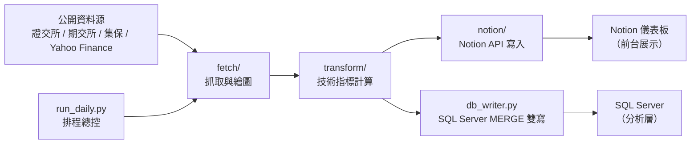

# invest-signals｜台股籌碼資料自動化管線

用 Python 自建的台股／美股籌碼與行情資料管線：每日排程抓取公開資料，
自動計算技術指標、更新圖表，並同步雙寫到 Notion（前台展示）與本地
SQL Server（分析層），取代原本每天手動盤點籌碼的流程。

> ⚠️ 訊號判定規則（門檻值、決策樹分層邏輯）已參數化抽離至 config／.env，
> 判定模組不在公開範圍；追蹤清單（tickers.py）屬個人投資組合，亦不公開。
> 本 repo 展示的是資料工程部分：抓取、清洗、指標計算、資料庫設計與排程自動化。

## 📊 專案規模

- 追蹤 **59 檔**標的（台股 29＋美股 30），新增／移除標的免改程式（watchlist 驅動）
- SQL Server 累計回填 **14,296 列**價量＋**14,296 列**技術指標（schema 共 **7 張表**）
- 每日兩個時段全自動執行（16:00 行情／22:00 籌碼），零人工介入

## 🏗 系統架構



## 📁 專案結構

```txt
invest-signals/
├─ run_daily.py               ★ 排程總控（--slot day 16:00 / --slot night 22:00）
├─ db_writer.py               SQL Server 雙寫共用模組（pyodbc + T-SQL MERGE）
├─ sync_price.py              股價同步 → Notion
├─ backfill_market_chips.py   歷史資料回補（一次性工具）
├─ fetch/                     資料抓取與繪圖
│   ├─ fetch_price.py         價量抓取（yfinance / twstock）
│   ├─ fetch_stock_chips.py   個股三大法人＋融資融券（證交所）
│   ├─ fetch_tdcc.py          集保股權分散表（千張／400張大戶比率）
│   ├─ plot_stock_charts.py   籌碼組合圖（Plotly 互動版，嵌入 Notion）
│   └─ plotly-finance.min.js  自帶 Plotly 引擎（Notion 沙盒擋 CDN，須注入）
├─ transform/
│   └─ indicators.py          技術指標共用函式（MA5–120、BIAS、BOLL、量能）
├─ notion/
│   ├─ notion_writer.py       大盤籌碼抓取＋Notion 寫入
│   └─ backfill.py            歷史回補
└─ sql/
    ├─ schema.sql             7 張表 DDL
    └─ demo_queries.sql       展示查詢（JOIN／window／連續天數統計）
```

## 🗄 資料庫設計（sql/schema.sql）

- **7 張表 DDL**：代號＋日期**複合主鍵**、**日頻／週頻分表**、**raw／衍生資料分層**
- 以 `pyodbc` ＋ T-SQL `MERGE` 實作 upsert：重複執行不重複寫入（冪等）
- 驗收流程：筆數比對、冪等驗證、`IS NULL` 品質稽核

## 🔧 工程重點

| 主題 | 做法 |
| --- | --- |
| 資料可靠性 | 以「代號＋資料日期」為唯一鍵 upsert 去重；自動略過非交易日並記 log |
| 請求限速 | 1.5 秒間隔＋失敗 3 次重試，避免對資料源造成負擔 |
| NaN → NULL | pandas float dtype 會把 None 轉回 NaN，先 `.astype(object)` 再替換，讓缺值正確落成 SQL NULL |
| 圖表嵌入 | Notion 沙盒會執行檔案內 JS 但擋外部 CDN → Plotly 引擎自帶、以 base64 注入 HTML |
| 缺漏防復發 | 排程加 `--refill` 回補近 5 天既有列；支援 `--days N` 大範圍歷史回補 |
| 環境管理 | uv 管理套件與虛擬環境；金鑰全部走 `.env`（不進版控） |

## 🚀 使用方式

```bash
uv sync                                  # 安裝依賴
uv run python run_daily.py --slot day    # 行情時段（16:00）
uv run python run_daily.py --slot night  # 籌碼時段（22:00）
```

搭配 Windows 工作排程器每日自動執行。

## 📡 資料來源

- 證交所 OpenAPI：三大法人買賣超、融資融券、借券賣出、外資持股比率、收盤行情
- 期交所 OpenAPI：三大法人期貨部位
- 集保結算所：股權分散表（大戶比率）
- Yahoo Finance（yfinance）／twstock：價量資料